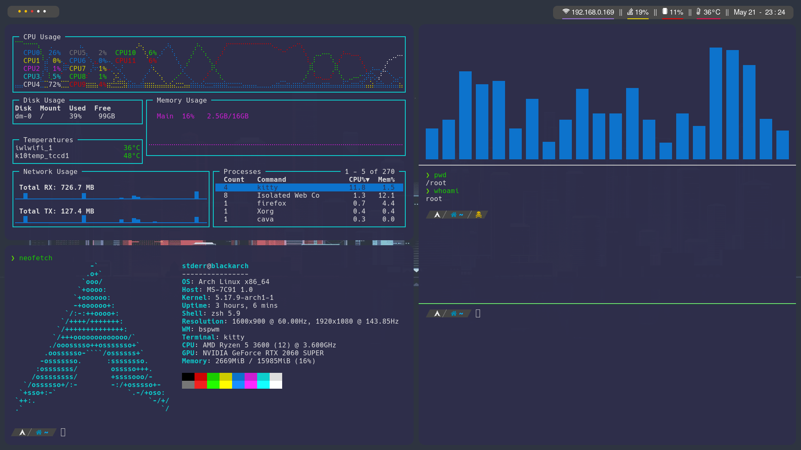

# Entorno

- WM: bspwm
- Menu: rofi
- Bar: polybar
- Terminal: kitty
- Text editor: nvim

# Arch linux installation guide
[arch-install-commands.md](arch-install-commands.md)

# BINDS LIST

bspwm binds (sxhkd)
===================================================
	
	$HOME/.config/sxhkd/sxhkdrc

Open terminal
- mod + enter

Program launcher (rofi)
- mod + d

Quit bspwm
- mod + alt + q

Restart bspwm
- mod + alt + r

Close and kill
- mod + w

Alternate between the tiled and monocle layout
- mod + m

Screenshot 
- mod + shift + s

Open firefox
- mod + shift + f

Kitty binds
===================================================
Open new window
- ctrl + shift + enter

Move neighbor window
- alt + arrows

Close window
- ctrl + shift + w

Resize window
- ctrl + shift + r

Change windows layout 
- ctrl + shift + l

Zoom up window
- ctrl + shift + z

Open new tab 
- ctrl + shift + t

Rename new tab
- ctrl + shit + alt + t

Move in tabs
- ctrl + shift + arrows

Close tab
- ctrl + shift + w

Move tabs 
- ctrl + shift + {, or .}

Fzf binds
===================================================
List files and folders in current directory
- ctrl + t 

Reach history of shell commands
- ctrl + r
